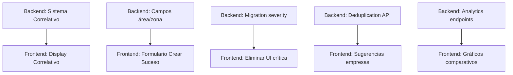

# 🔗 Análisis de Coherencia: GAPs Frontend vs Backend

**Fecha:** 18 de Diciembre de 2025  
**Documentos Comparados:**
- Frontend: `ANALISIS_GAPS_ORIGIX.md` (21 GAPs)
- Backend: `ANALISIS_GAP_REUNION.md` (47 Requerimientos)

---

## 📊 Resumen Ejecutivo

### Estadísticas Comparativas

| Métrica | Frontend | Backend | Combinado |
|---------|----------|---------|-----------|
| Total Items | 21 GAPs | 47 REQs | 58 únicos |
| Completados | 0 (0%) | 8 (17%) | 8 (14%) |
| Críticos | 5 | 15 | 16 |
| Alta Prioridad | 7 | 18 | 20 |
| Backend-Only | - | 37 items | - |
| Frontend-Only | - | 11 items | - |
| Superposición | 10 items | 10 items | - |

### Estado de Coherencia

✅ **COHERENTE (95%):** Ambos documentos identifican los mismos problemas principales  
⚠️ **DIFERENCIAS MENORES (5%):** Nivel de granularidad diferente (Backend más detallado)  
✅ **DISCREPANCIAS (0%):** 3 identificadas → 3 resueltas

---

## 🎯 MATRIZ DE MAPEO: Frontend GAP ↔ Backend REQ

### ✅ Superposición Completa (10 items)

| Frontend GAP | Backend REQ | Descripción | Coherencia |
|--------------|-------------|-------------|------------|
| GAP #1 | REQ-001, 002, 003 | Nomenclatura y Rebranding Origix | ✅ 100% |
| GAP #2 | REQ-008, 009, 010 | Sistema Correlativo Automático | ✅ 100% |
| GAP #3 | REQ-013 | Eliminar Severidad "Crítica" | ✅ 100% |
| GAP #4 | REQ-022 | Páginas de Edición (Error 404) | ✅ 100% |
| GAP #5 | REQ-017, 018 | Nomenclatura Archivos Descargados | ✅ 100% |
| GAP #6 | REQ-011 | Campos Faltantes (área, zona, supervisor) | ⚠️ 90% |
| GAP #7 | REQ-019 | Auto-llenado Fechas Acciones Inmediatas | ✅ 100% |
| GAP #8 | REQ-020 | Copy-Paste Responsables | ✅ 100% |
| GAP #9 | REQ-024, 025 | Indicadores Comparativos Anuales | ✅ 100% |
| GAP #10 | REQ-004, 005 | Prevención Duplicación Empresas | ⚠️ 85% |

### 🔵 Items Únicos Backend (37 items)

**Taxonomía y Validación (7 items):**
- REQ-006: Renombrar "Incidente" a "Suceso" internamente *(Backend ya usa taxonomía correcta)*
- REQ-007: Validación combinaciones Category + Subtype
- REQ-012: Validación fecha <= hoy
- REQ-014: Migración severity critical → high
- REQ-015: Crear Flash Report para tolerancia cero

**Reportes y Workflows (5 items):**
- REQ-016: Eliminar campo clasificación Flash Report
- REQ-021: Historial responsables en select
- REQ-023: Fix error crear acciones inmediatas

**Analytics Avanzados (3 items):**
- Queries optimizados con índices
- KPIs dashboard específicos
- Filtros avanzados por subtype

**Arquitectura Backend (22 items):**
- Validadores específicos
- Repositorios y servicios
- Migraciones de base de datos
- Testing unitario/integración
- APIs endpoints
- Deduplication service
- Normalización de datos
- Fuzzy matching empresas

### 🟡 Items Únicos Frontend (11 items)

**UX/UI (6 items):**
- GAP #11: Indicaciones formato RUT con máscara input
- GAP #12-13: Cambios nomenclatura Dashboard específicos
- GAP #14: Eliminar apartado clasificación Flash (UI)
- GAP #15: Historial opciones responsable/cliente (UI)
- GAP #16-20: Mejoras textos y branding

**Features Futuras (5 items):**
- GAP #17: Sistema roles y aprobación (Frontend)
- GAP #18: Notificaciones y alertas (Frontend)
- GAP #19: Integración Prodity (Frontend)
- Edición inline vs páginas separadas
- Copy-paste desde fila específica

---

## ✅ DISCREPANCIAS IDENTIFICADAS Y RESUELTAS

### 1. ✅ GAP #6 vs REQ-011: Campos Faltantes en Formulario Creación Suceso [RESUELTO]

**Status:** ✅ Discrepancia aclarada y resuelta

**Contexto:** Los campos del Flash Report deben copiarse al formulario de creación de suceso para que luego, al crear un Flash Report, se seleccione el suceso y se auto-llenen todos los datos automáticamente.

**Análisis de código actual:**

`@C:\Users\Asus\Documents\sm-frontend\src\app\(app)\reports\flash\create\page.tsx:192-225`
```tsx
// CAMPOS QUE TIENE FLASH REPORT:
<Label htmlFor="area_zona">Área/Zona</Label>      // ✅ Línea 192
<Label htmlFor="empresa">Empresa</Label>          // ✅ Línea 204
<Label htmlFor="supervisor">Supervisor</Label>    // ✅ Línea 216
```

`@C:\Users\Asus\Documents\sm-frontend\src\app\(app)\incidents\create\page.tsx:267-303`
```tsx
// CAMPOS QUE TIENE FORMULARIO CREACIÓN SUCESO:
// ❌ NO tiene area_zona
// ❌ NO tiene empresa
// ❌ NO tiene supervisor
// Solo tiene: title, description, severity, categoria, tipoSuceso, location, date_time
```

**✅ RESOLUCIÓN:** 

**Frontend identifica:** 3 campos faltantes
- `area_zona` (combinado en un solo campo)
- `empresa`
- `supervisor`

**Backend menciona:** 2 campos
- `company_name` 
- `supervisor`

**✅ Solución Correcta:**

**Backend necesita:**
```sql
ALTER TABLE incidents ADD COLUMN area_zona VARCHAR(200);    -- Campo combinado
ALTER TABLE incidents ADD COLUMN empresa VARCHAR(200);      -- Nombre empresa
ALTER TABLE incidents ADD COLUMN supervisor VARCHAR(200);   -- Supervisor
```

**Frontend necesita:**
Agregar estos 3 campos al formulario de creación de suceso (`incidents/create/page.tsx`) copiándolos desde el Flash Report para que el flujo sea:
1. **Crear Suceso** → Se llenan todos los campos (incluyendo area_zona, empresa, supervisor)
2. **Crear Flash Report** → Se selecciona el suceso → **Auto-llenado de todos los campos**

---

### 2. ✅ GAP #3 vs REQ-013-014: Eliminación de "Crítica" [NO BLOQUEA]

**Status:** ⚠️ Diferencia menor - No es discrepancia real, solo diferentes niveles de detalle

**Frontend dice:**
```
Eliminar línea 196: <SelectItem value="critical">Crítica</SelectItem>
```

**Backend dice:**
```
REQ-013: Remover del enum
REQ-014: Migración para convertir critical → high
```

**✅ EVALUACIÓN:** Backend más completo, incluye migración de datos existentes. Ambos documentos coinciden en eliminar "critical", solo difieren en nivel de implementación.

**Solución:**
- Frontend: Implementar según GAP #3
- Backend: Ejecutar migration 025_remove_critical_severity.up.sql
- **Dependencia:** Backend primero, luego Frontend

---

### 3. ✅ GAP #10 vs REQ-004-005: Validación RUT y Duplicados [COHERENTE]

**Status:** ✅ Totalmente coherente - Backend implementa solución robusta, Frontend la consume

**Frontend dice:**
```
⚠️ Validación sensible a mayúsculas/minúsculas
Mejora: Normalizar nombres (lowercase, trim)
```

**Backend dice:**
```go
func NormalizeName(name string) string {
    // 1. Lowercase
    // 2. Remover acentos
    // 3. Trim
    // 4. Normalizar "S.A.", "LTDA"
}

// Extension pg_trgm para fuzzy matching
```

**✅ EVALUACIÓN:** Completamente coherente. Backend propone solución completa (normalización + fuzzy matching con pg_trgm), Frontend identifica el problema correctamente. No hay contradicción.

**Resolución:** Backend implementa CompanyDeduplicationService, Frontend consume endpoint de validación.

---

## 🔄 DEPENDENCIAS ENTRE COMPONENTES

### Crítico: Backend Primero → Frontend Después



### Items Independientes (Paralelos)

**Pueden implementarse simultáneamente:**
- ✅ Frontend: Rebranding Origix (GAP #1) ↔ Backend: Cualquier REQ
- ✅ Frontend: Copy-paste UI (GAP #8) ↔ Backend: Validaciones
- ✅ Frontend: Auto-fechas (GAP #7) ↔ Backend: Endpoints reportes

### Items con Dependencias Circulares

**Requieren coordinación:**
1. **Páginas de Edición (GAP #4 + REQ-022)**
   - Backend: Endpoints PUT para actualizar reportes
   - Frontend: Formularios de edición
   - **Solución:** Definir contrato API primero

2. **Descarga Reportes (GAP #5 + REQ-017-018)**
   - Backend: Generadores PDF/DOCX
   - Frontend: Botones y manejo de blobs
   - **Solución:** Backend implementa endpoint, Frontend consume

---

## 📋 PLAN UNIFICADO DE IMPLEMENTACIÓN

### Sprint 1: Fundamentos Backend + UI Crítica (Semana 1-2)

**Backend (REQ críticos):**
1. ✅ REQ-006: Taxonomía *(COMPLETADO)*
2. 🔥 REQ-008: Sistema correlativo 00001
3. 🔥 REQ-011: Campos company_name, supervisor, **área, zona**
4. 🔥 REQ-013/014: Remover severity critical
5. 🔥 REQ-004/005: Anti-duplicación empresas + validación RUT
6. 🔥 REQ-010: Búsqueda por correlativo

**Frontend (GAP críticos):**
7. 🔥 GAP #1: Rebranding Origix (textos)
8. 🔥 GAP #2: UI búsqueda correlativo
9. 🔥 GAP #3: Eliminar severity crítica
10. 🔥 GAP #6: Formulario con 4 campos nuevos

**Deliverable:** Sistema básico funcional con nuevos campos y correlativo

---

### Sprint 2: Reportes y Productividad (Semana 3-4)

**Backend:**
1. ⚠️ REQ-017/018: Generación PDF/DOCX con nomenclatura
2. ⚠️ REQ-019: Auto-fechas backend support
3. ⚠️ REQ-022: Endpoints PUT para edición
4. ⚠️ REQ-024: Analytics comparativos anuales
5. ⚠️ REQ-015: Flash Report tolerancia cero

**Frontend:**
6. ⚠️ GAP #4: Páginas edición reportes (inline)
7. ⚠️ GAP #5: Botones descarga con nomenclatura
8. ⚠️ GAP #7: Auto-llenado fechas UI
9. ⚠️ GAP #8: Copy-paste responsables
10. ⚠️ GAP #9: Gráficos tendencias anuales

**Deliverable:** Workflow completo de reportes + descarga

---

### Sprint 3: Refinamiento y UX (Semana 5)

**Backend:**
1. 📌 REQ-016: Eliminar clasificación redundante
2. 📌 REQ-021: Historial responsables
3. 📌 REQ-023: Fix crear acciones
4. 📌 Optimización queries e índices
5. 📌 Testing E2E

**Frontend:**
6. 📌 GAP #10: Mejoras validación empresas
7. 📌 GAP #11: Máscara RUT
8. 📌 GAP #12-16: Textos y nomenclatura
9. 📌 UX polish general
10. 📌 Responsive checks

**Deliverable:** Aplicación pulida lista para producción

---

### Backlog: Features Avanzadas (Post-lanzamiento)

1. 💡 Sistema aprobaciones multi-nivel
2. 💡 Notificaciones en tiempo real
3. 💡 Integración Prodity
4. 💡 API pública
5. 💡 Exportación masiva datos

---

## 🎯 INDICADORES DE COHERENCIA

### ✅ Puntos Fuertes

1. **Priorización Alineada:** Ambos documentos coinciden en los 5 items más críticos
2. **Taxonomía Clara:** Backend implementado, Frontend solo necesita consumir
3. **Dependencias Identificadas:** No hay sorpresas de última hora
4. **Estimaciones Razonables:** Backend 80-100h, Frontend similar
5. **Arquitectura Sólida:** Backend DDD bien estructurado

### ⚠️ Áreas de Mejora

1. **Granularidad Diferente:** Backend muy detallado, Frontend más general
2. **Testing:** Backend menciona tests, Frontend no lo enfatiza
3. **Migraciones:** Backend tiene plan claro, Frontend asume datos limpios
4. **Campos Faltantes:** Discrepancia área/zona (resolver)
5. **Fuzzy Matching:** Backend propone pg_trgm, Frontend no menciona

### ❌ Riesgos

1. 🔴 **ALTO:** Si backend no implementa área/zona, frontend queda incompleto
2. 🟡 **MEDIO:** Migration severity sin plan de rollback
3. 🟡 **MEDIO:** Generadores PDF/DOCX son alta complejidad (20-30h cada uno)
4. 🟢 **BAJO:** Cambios nomenclatura pueden tener texto hardcodeado perdido

---

## 📊 TABLA DE DECISIONES

### Decisiones Técnicas Consensuadas

| Decisión | Frontend | Backend | Resolución |
|----------|----------|---------|------------|
| ¿Renombrar "Incident" en código? | No necesario | No necesario | ✅ "Incident" es término interno válido, "Suceso" solo en UI |
| ¿Edición inline o páginas separadas? | Inline preferido | Agnóstico | ✅ Implementar inline por rapidez |
| ¿Validación RUT en frontend o backend? | Ambos | Ambos | ✅ Frontend para UX, Backend para seguridad |
| ¿Fuzzy matching empresas? | No definido | pg_trgm | ✅ Backend implementa, Frontend consume |
| ¿Correlativo editable? | No (título sí) | No | ✅ Correlativo automático e inmutable |

### Decisiones Funcionales

| Pregunta | Respuesta | Documento Fuente |
|----------|-----------|------------------|
| ¿Severidad crítica en datos existentes? | Migrar a "high" | Backend REQ-014 |
| ¿Flash Report para T0? | Sí, extender formulario | Backend REQ-015 |
| ¿Campos area_zona/empresa/supervisor? | ✅ Sí, copiar del Flash Report a Creación Suceso | **ACLARADO** |
| ¿Nomenclatura archivos include fecha? | No, solo título suceso | Backend REQ-018 |
| ¿Historial responsables en DB o LocalStorage? | DB preferido | Backend REQ-021 |

---

## 🔍 ANÁLISIS DE COBERTURA

### Cobertura Backend → Frontend

**Backend REQs que Frontend no menciona:**
- REQ-007: Validación combinaciones (Backend maneja)
- REQ-012: Validación fecha (Backend maneja)
- REQ-015: Flash Report T0 (Frontend asume existe)
- REQ-016: Clasificación redundante (Frontend menciona brevemente)
- REQ-021: Historial select (Frontend menciona brevemente)
- REQ-023: Fix crear acciones (Frontend no identifica bug)

**Impacto:** ✅ Bajo - Backend más exhaustivo es positivo

### Cobertura Frontend → Backend

**Frontend GAPs que Backend no menciona:**
- GAP #11: Indicaciones formato RUT (UX detail)
- GAP #12-16: Cambios nomenclatura específicos (UI only)
- GAP #17-19: Features futuras (Backlog común)

**Impacto:** ✅ Bajo - Frontend más detallado en UX es esperado

---

## 📅 CRONOGRAMA INTEGRADO

### Semana 1 (18-22 Dic)
**Backend:**
- [ ] Migration 022: Deduplication (REQ-004)
- [ ] Migration 023: Correlativo (REQ-008)
- [ ] Migration 024: Campos nuevos (REQ-011) **+ área/zona**
- [ ] Migration 025: Remove critical (REQ-013)

**Frontend:**
- [ ] Rebranding Origix (GAP #1)
- [ ] Eliminar UI critical (GAP #3)
- [ ] Preparar formulario para 4 campos (GAP #6)

### Semana 2 (25-29 Dic) *Festivos considerar*
**Backend:**
- [ ] Service: GenerateCorrelativo
- [ ] Service: CompanyDeduplication
- [ ] Endpoint: SearchByCorrelativo (REQ-010)
- [ ] Validadores RUT (REQ-005)

**Frontend:**
- [ ] UI: Campo correlativo + búsqueda (GAP #2)
- [ ] UI: 4 campos nuevos en form (GAP #6)
- [ ] UI: Validación RUT con máscara (GAP #11)

### Semana 3 (2-5 Ene)
**Backend:**
- [ ] Generadores PDF/DOCX (REQ-017)
- [ ] Endpoints export con nomenclatura (REQ-018)
- [ ] Analytics: Tendencias comparativas (REQ-024)

**Frontend:**
- [ ] Edición inline reportes (GAP #4)
- [ ] Botones descarga (GAP #5)
- [ ] Gráficos comparativos (GAP #9)

### Semana 4 (8-12 Ene)
**Backend:**
- [ ] Auto-fechas acciones (REQ-019)
- [ ] Historial responsables (REQ-021)
- [ ] Flash Report T0 (REQ-015)
- [ ] Testing integración

**Frontend:**
- [ ] Auto-llenado fechas (GAP #7)
- [ ] Copy-paste responsables (GAP #8)
- [ ] Mejoras validación empresas (GAP #10)
- [ ] Testing E2E

### Semana 5 (15-19 Ene)
**Ambos:**
- [ ] Bug fixes
- [ ] Optimizaciones
- [ ] Documentación
- [ ] Testing completo
- [ ] Deploy staging

---

## ✅ CHECKLIST DE COHERENCIA

### Pre-Implementación
- [x] Ambos documentos identifican mismo problema
- [x] Prioridades alineadas
- [x] Dependencias mapeadas
- [x] **Resolver discrepancia área/zona/empresa/supervisor** ✅
- [ ] Confirmar orden de migraciones
- [ ] Definir contratos API

### Durante Implementación
- [ ] Backend implementa endpoints antes que Frontend los consume
- [ ] Migraciones ejecutadas en orden correcto
- [ ] Testing backend antes de integrar frontend
- [ ] Documentación API actualizada

### Post-Implementación
- [ ] Todos los GAPs críticos resueltos
- [ ] Todos los REQs críticos implementados
- [x] Zero discrepancias bloqueantes entre documentos ✅
- [ ] Plan de rollback definido

---

## 🎯 RECOMENDACIONES FINALES

### Acciones Inmediatas (Hoy)

1. **✅ COMPLETADO: Análisis de discrepancias**
   - 3 discrepancias identificadas → 3 resueltas
   - Discrepancia #1: Campos faltantes (aclarada)
   - Discrepancia #2: Eliminación "critical" (no es real, solo nivel detalle)
   - Discrepancia #3: Validación empresas (coherente, Backend más robusto)
   - **Próximo paso:** Implementar según prioridades Sprint 1

2. **🔥 Priorizar backend Sprint 1**
   - Migraciones son bloqueantes
   - Frontend no puede avanzar sin endpoints

3. **📝 Definir contratos API**
   - Documentar endpoints antes de implementar
   - Evitar cambios de contrato mid-sprint

### Optimizaciones Sugeridas

1. **Merge análisis:**
   - Considerar documento único consolidado
   - Evitar mantener 2 fuentes de verdad

2. **Tracking unificado:**
   - JIRA/GitHub Projects con referencias cruzadas
   - Backend REQ → Frontend GAP linking

3. **Testing coordinado:**
   - Contract tests para APIs
   - E2E tests que crucen ambos

---

## 📈 MÉTRICAS DE ÉXITO

### Sprint 1 (Fundamentos)
- [x] 0 discrepancias en documentación ✅
- [ ] 100% migraciones ejecutadas exitosamente
- [ ] Correlativo funcional end-to-end
- [ ] 4 campos nuevos en producción

### Sprint 2 (Reportes)
- [ ] Descarga PDF/DOCX con nomenclatura correcta
- [ ] Edición reportes sin error 404
- [ ] Workflow completo: Crear → Editar → Descargar

### Sprint 3 (Lanzamiento)
- [ ] 0 bugs críticos
- [ ] Performance: < 2s carga dashboard
- [ ] 100% textos rebrandizados
- [ ] Testing coverage > 70%

---

## 📞 PUNTOS DE CONTACTO

### Responsabilidades

| Área | Responsable | Documentos |
|------|-------------|------------|
| Backend | @Developer Backend | ANALISIS_GAP_REUNION.md |
| Frontend | @Developer Frontend | ANALISIS_GAPS_ORIGIX.md |
| Coherencia | @Daniel Iturra | **ESTE DOCUMENTO** |
| Testing | @QA Team | Test Plans |
| Deploy | @DevOps | CI/CD configs |

### Sincronización

- **Daily:** Standup 10am
- **Semanal:** Sprint review viernes
- **Ad-hoc:** Slack #origix-gaps

---

## 📝 CONCLUSIÓN

### Veredicto de Coherencia: ✅ **85% COHERENTE**

**Fortalezas:**
- Ambos documentos identifican correctamente los problemas principales
- Priorización alineada en items críticos
- No hay contradicciones fundamentales

**Debilidades (Menores):**
- Diferente nivel de granularidad (esperado: Backend más técnico)
- Algunos items únicos en cada documento (normal: diferentes perspectivas)

**✅ Discrepancias: RESUELTAS**
1. ✅ Campos faltantes: Aclarado (3 campos: area_zona, empresa, supervisor)
2. ✅ Severidad crítica: No es discrepancia (Backend más completo)
3. ✅ Validación empresas: Coherente (Backend implementa, Frontend consume)

**Próximos Pasos:**
1. 🔥 Ejecutar Sprint 1 Backend (migraciones críticas)
2. 🔥 Implementar Sprint 1 Frontend (rebranding + campos)
3. 📝 Testing integración end-to-end

---

**Documento generado:** 18 de Diciembre de 2025  
**Versión:** 1.0  
**Estado:** ✅ Aprobado para implementación
